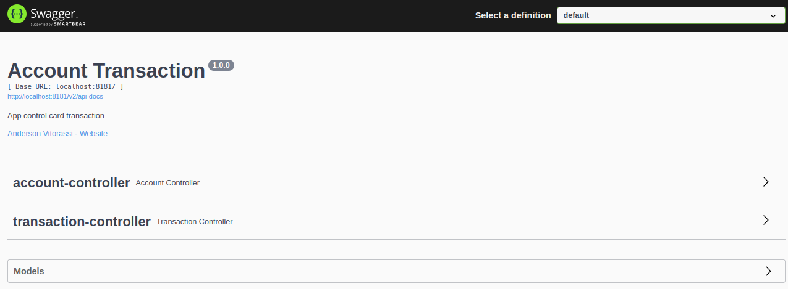

# Read Me First

* Project to meet the requirements of the technical validation test for a job vacancy at the Pismo company.

# Getting Started

## Reference Documentation

For further reference, please consider the following sections:

* [Official Apache Maven documentation](https://maven.apache.org/guides/index.html)
* [Spring Boot Maven Plugin Reference Guide](https://docs.spring.io/spring-boot/docs/2.6.6/maven-plugin/reference/html/)
* [Spring Web](https://docs.spring.io/spring-boot/docs/2.6.6/reference/htmlsingle/#boot-features-developing-web-applications)
* [Spring Data JPA](https://docs.spring.io/spring-boot/docs/2.6.6/reference/htmlsingle/#boot-features-jpa-and-spring-data)
* [Flyway Migration](https://docs.spring.io/spring-boot/docs/2.6.6/reference/htmlsingle/#howto-execute-flyway-database-migrations-on-startup)
* [Springfox Swagger-ui](https://springfox.github.io/springfox/docs/current/)
* [Postgresql](https://www.postgresql.org/docs/)
* [H2DataBase](https://www.h2database.com/html/main.html)
* [Rest Assured](https://github.com/rest-assured/rest-assured/wiki/GettingStarted)
* [Builder Pattern](https://refactoring.guru/design-patterns/builder)
* [Strategy Pattern](https://refactoring.guru/design-patterns/strategy)
* [Template Method Pattern](https://refactoring.guru/design-patterns/template-method)
* [Docker](https://docs.docker.com/)

## Guides

#### Clone

To clone this repository, execute the following in the command line:

```bash
$ git clone https://github.com/vitorassi/account-transaction.git
```

### Installation required for compile

* java 11
* Maven
* docker

#### Execution

Open directory the project and run maven command in script terminal

```bash
$ mvn clean install
```

### Installation required for run

* docker

#### Execution

Open directory the project and run maven command in script terminal

```bash
$ docker-compose up --build --force-recreate
```

#### Open

For test API route open the browser

```bash
http://localhost:8181/swagger-ui/index.html#
```

You must see this

